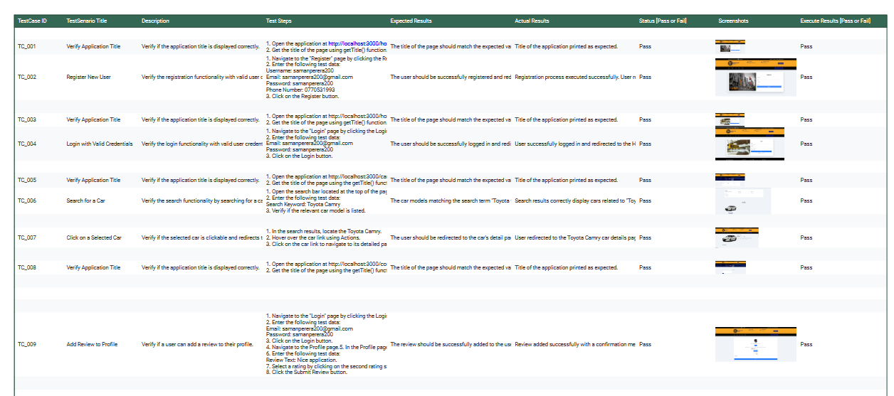
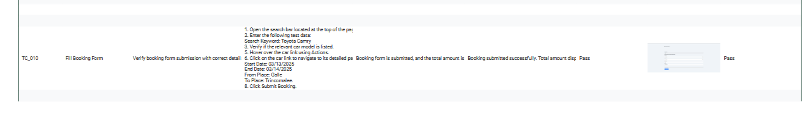
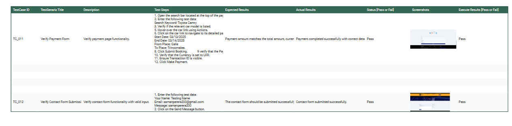

# Selenium Automation Test Cases for Web Application

This project includes Selenium automation tests for a web application. The tests cover various functionalities such as **Login**, **Registration**, **Search Car**, **Add Review**, **Car Booking and Payment**, and **Contact Form**. Below is a comprehensive list of all the test cases and their execution results.

---

## Test Cases Summary

## Setup Instructions

1. **Prerequisites**:
    - Ensure that **Java**, **Maven**, and **Selenium WebDriver** are installed.
    - Set up **ChromeDriver** for the Chrome browser.
    - Ensure that the application is running at **http://localhost:3000**.

2. **Run Tests**:
    - You can run the tests using **TestNG** by executing the `TestNG` suite in your IDE or via command line.

---

## Notes
- **Test Steps** include specific **Test Data** used for each action.
- **Expected Results** reflect what should happen after performing the steps.
- **Actual Results** are based on the outcome after executing the test cases.
- **Execute Results** indicate the final result of the test execution (Pass/Fail).

---

Feel free to modify or expand the instructions as per your requirements. This file can now serve as a comprehensive reference for understanding the tests and their execution process!

